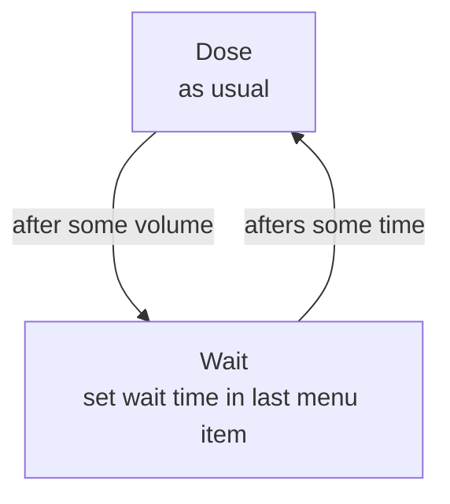

# Open-Source-Peristaltic-Pump

Our software uses two libraries (ClickEncoder.h & TimerOne.h), which are required to be installed from a .zip-file before. You can find a brief tutorial on how to install libraries here:
https://www.arduino.cc/en/Guide/Libraries#toc4

Required libraries:
https://github.com/0xPIT/encoder
http://playground.arduino.cc/Code/Timer1

Uses v1.01, as this is indeed a better version

## Added use case

The new use case is:

- pump a dose
- wait

To do so:

- In the menu, go to the 'Mode' item and select 'DoseWait'
- In the menu, go to the 'Volume' item and set the dose
- In the menu, go to the 'Wait' item and set the waiting time
